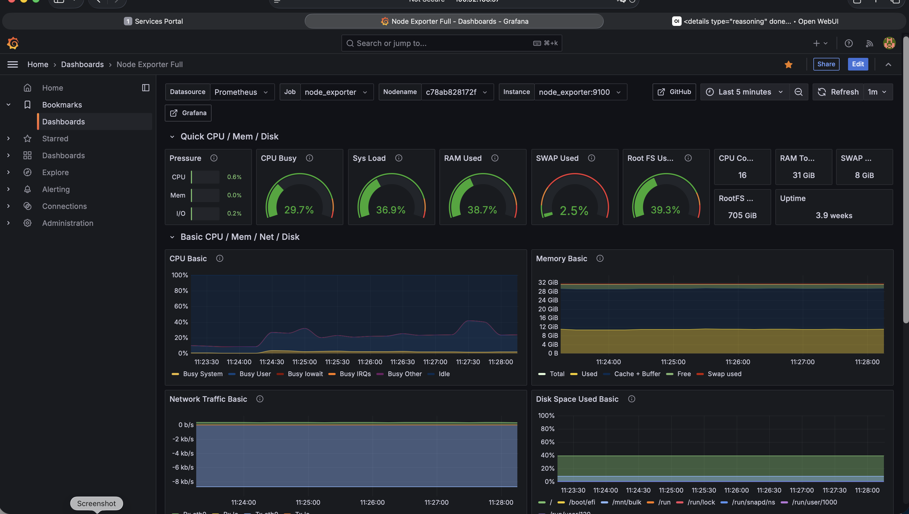
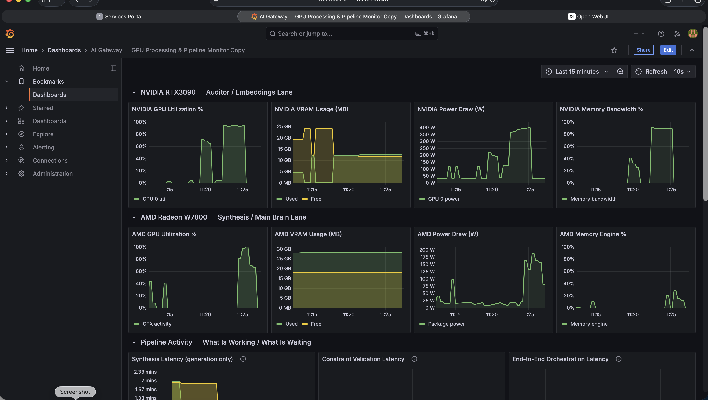
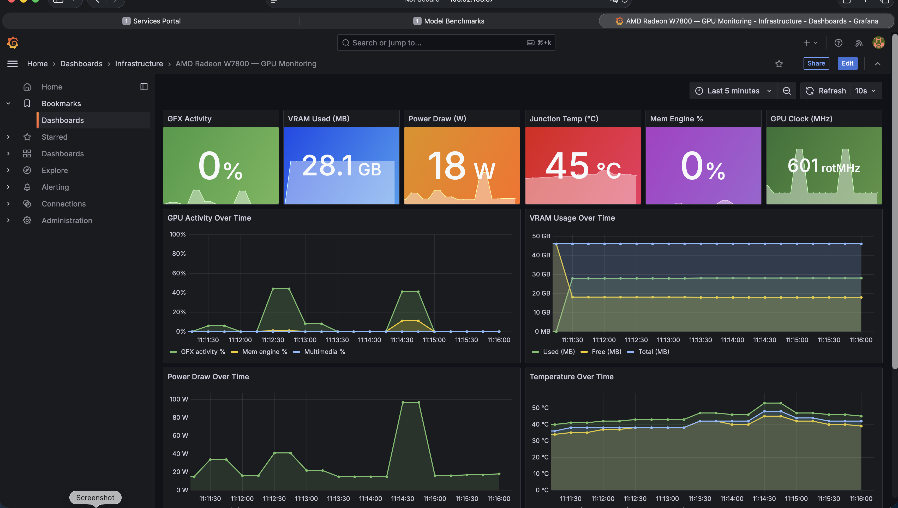

# AI Workstation Infrastructure

Docker Compose orchestration for a dual-GPU AI workstation running NVIDIA RTX 3090 and AMD Radeon Pro W7800.

## What This Demonstrates

- **Container orchestration** for 20+ services on a shared bridge network
- **Dual-GPU infrastructure** with NVIDIA DCGM and AMD ROCm exporters
- **Full observability stack**: Prometheus, Grafana (28 dashboards), Jaeger distributed tracing, blackbox probing
- **AI service platform**: LLM routing gateway, vector database (Qdrant), search engine (SearXNG), image generation (ComfyUI)
- **Document processing pipeline**: Paperless-ngx with OCR (Tika + Gotenberg), multi-language support
- **GPU-pinned model serving**: Dual Ollama instances with isolated GPU assignment via systemd

## Screenshots

| Observability | Description |
|---|---|
|  | Prometheus/Grafana host overview telemetry |
|  | Prometheus/Grafana telemetry for heterogeneous GPU pipeline |
| | Prometheus/Grafana telemetry for AMD GPU infrastructure |

## Architecture

```
                          ai-internal bridge (172.19.0.0/16)
                         ┌──────────────────────────────────┐
  ┌─────────┐            │  prometheus ─── grafana           │
  │ Ollama  │ :11434     │  node_exporter  cadvisor          │
  │ NVIDIA  │◄───────────│  dcgm_exporter  blackbox          │
  └─────────┘            │  device_metrics_exporter          │
  ┌─────────┐            │  jaeger                           │
  │ Ollama  │ :11435     │                                   │
  │  AMD    │◄───────────│  ai-gateway ── qdrant ── searxng  │
  └─────────┘            │  open-webui    comfyui            │
   (systemd)             │  portal        python-sandbox     │
                         │  paperless ── redis ── postgres   │
                         │                                   │
                         │  host-network services:           │
                         │  ai-automation (8090/8092)        │
                         │  automation-ui (8093)             │
                         │  orchestrator-db (5446)           │
                         └──────────────────────────────────┘
```

## Quick Start

1. Clone companion repos alongside this one:
   ```
   ~/infrastructure-public/       # this repo
   ~/ai-gateway-public/
   ~/model_benchmarks-public/
   ~/portal-public/
   ```

2. Create your secrets file (outside any repo):
   ```bash
   cp .env.example ~/.env.paperless
   # Edit ~/.env.paperless with real values
   ```

3. Start all services:
   ```bash
   docker compose -f docker-compose.yml \
     --project-name ai-stack \
     --env-file ~/.env.paperless \
     up -d
   ```

4. Verify:
   ```bash
   docker compose -f docker-compose.yml \
     --project-name ai-stack \
     --env-file ~/.env.paperless \
     ps
   ```

## Service Map

| Service | Port | Purpose |
|---------|------|---------|
| Prometheus | 9091 | Metrics collection & alerting |
| Grafana | 3001 | Dashboards & visualization |
| Jaeger | 16686 | Distributed tracing UI |
| AI Gateway | 8088 | LLM routing & orchestration API |
| Open WebUI | 3000 | Chat interface |
| Qdrant | 6333 | Vector database |
| SearXNG | 8081 | Meta search engine |
| ComfyUI | 8188 | Image generation |
| Paperless-ngx | 8010 | Document management |
| Portal | 3002 | Service discovery & control |
| cAdvisor | 8080 | Container resource metrics |
| DCGM Exporter | 9400 | NVIDIA GPU metrics |
| AMD Metrics | 5000 | AMD GPU metrics |
| Blackbox | 9115 | HTTP endpoint probing |
| Ollama (NVIDIA) | 11434 | LLM inference (RTX 3090) |
| Ollama (AMD) | 11435 | LLM inference (W7800) |
| **Automation API** | **8090** | **Task scheduling & execution (host network)** |
| **Automation Metrics** | **8092** | **Prometheus metrics for automation (host network)** |
| **Automation UI** | **8093** | **Task management frontend (host network)** |
| **Orchestrator DB** | **5446** | **PostgreSQL for tasks/runs/steps** |

## Storage Layout

All persistent data lives on `/mnt/data/`:

| Path | Size | Purpose |
|------|------|---------|
| `models/ollama` | ~306G | Ollama model store |
| `comfyui` | ~72G | ComfyUI workspace |
| `open-webui` | ~5G | Open WebUI data |
| `rag/qdrant` | ~337M | Vector database storage |
| `observability/` | ~212M | Prometheus TSDB + Grafana |
| `paperless/` | ~228M | Document storage & DB |
| `ai-gateway` | ~148K | Gateway metadata |
| `models/huggingface` | varies | HuggingFace model cache |

## Companion Repositories

| Repo | Description |
|------|-------------|
| [ai-gateway-public](https://github.com/marembals/ai-gateway-public) | FastAPI AI routing gateway with dual-GPU model lanes, RAG, orchestration, and Automation Orchestrator |
| [model_benchmarks-public](https://github.com/marembals/model_benchmarks-public) | Multi-GPU LLM benchmarking system with validation pipeline |
| [portal-public](https://github.com/marembals/portal-public) | Docker service discovery and control panel |

## Automation Orchestrator

Three new services added to the compose stack:

| Service | Image | Purpose |
|:--------|:------|:--------|
| `orchestrator-db` | postgres:16 | PostgreSQL database for tasks, runs, and steps (port 5446) |
| `ai-automation` | ai-gateway Dockerfile.automation | FastAPI scheduling service; calls AI Gateway with per-task overrides (port 8090) |
| `automation-ui` | ai-gateway ui/automation Dockerfile | Standalone nginx frontend for task management (port 8093) |

All three use `network_mode: host` (same pattern as model_benchmarks) so they can reach
Ollama and the AI Gateway on localhost ports without additional routing.

The `ai-automation` service accepts these env vars:

| Variable | Default | Description |
|:---------|:--------|:------------|
| `ORCH_DATABASE_URL` | postgres on 5446 | SQLAlchemy async connection string |
| `ORCH_GATEWAY_URL` | http://localhost:8088 | AI Gateway base URL |
| `ORCH_GATEWAY_MODEL` | gemma4:26b-a4b-it-q8_0 | Default model when task has no override |
| `ORCH_API_PORT` | 8090 | FastAPI listen port |
| `ORCH_METRICS_PORT` | 8092 | Prometheus metrics port |
| `ORCH_LOG_DIR` | /app/logs | Rotating log directory |

## Observability

- **Prometheus** scrapes 10 targets (exporters, services, blackbox probes)
- **Grafana** provisions dashboards automatically from `grafana/provisioning/`
- **DCGM Exporter** provides NVIDIA GPU metrics with custom counters
- **ROCm Device Metrics Exporter** provides AMD GPU metrics
- **Blackbox Exporter** probes HTTP endpoints for availability

## System Configuration

Reference copies of host-level configs are in `system/`. See [system/README.md](system/README.md).

## Secrets Management

Secrets are stored in `~/.env.paperless` (outside all repos). Required variables:

| Variable | Purpose |
|----------|---------|
| `PAPERLESS_DB_PASSWORD` | Paperless PostgreSQL password |
| `PAPERLESS_ADMIN_PASSWORD` | Paperless admin login |
| `PAPERLESS_SECRET_KEY` | Paperless Django secret key |
| `HUGGING_FACE_HUB_TOKEN` | HuggingFace model downloads |
| `GRAFANA_ADMIN_PASSWORD` | Grafana admin password (default: admin) |

Pass secrets explicitly: `--env-file ~/.env.paperless`
